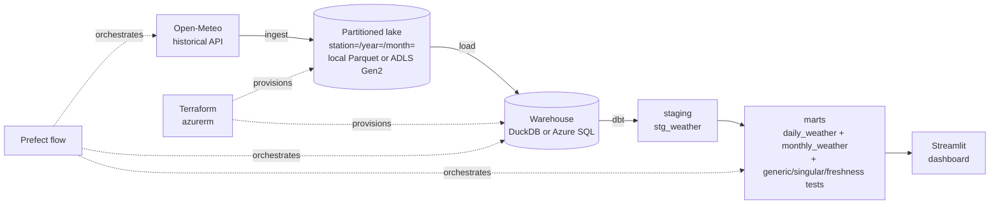

# Cameroon weather data pipeline

[](https://github.com/mbongowo/Data-science-Portfolio/actions/workflows/ci.yml)
[](https://www.python.org/)
[](https://github.com/astral-sh/ruff)
[](LICENSE)

**An end-to-end data-engineering pipeline, worked twice over.** Historical
weather for five Cameroon cities is **ingested** from the free Open-Meteo API,
landed in a partitioned **lake**, loaded into a **warehouse**, transformed by
**dbt** marts with tests, run on a schedule by **Prefect**, and read by a
**Streamlit** dashboard. It runs end to end **for free on DuckDB**, and the same
dbt models run on **Azure SQL** provisioned with **Terraform** when you opt in.

---

## Result first

The transformation and data-quality logic is reproducible **right now, with no
warehouse and no cloud**: `python -m weatherpipe.cli demo` drives the real
pure-pandas core (ingest -> validate -> monthly marts) over a seeded synthetic
year of daily weather for all five stations and reports real numbers.

```
demo (pure pandas, seed=0)  ->  runs in < 1s
  1823 clean daily records across 5 stations (Douala, Yaounde, Maroua, Garoua, Bamenda)
  3 planted bad rows rejected (tmin>tmax, negative precip, duplicate key) -> 99.84% valid
  hottest station-month : Garoua 2023-06, mean 35.74 C
  wettest month total   : 673.23 mm
  artifacts: outputs/monthly_summary.csv, outputs/validation_report.json
```

These numbers are pinned by `tests/test_demo.py`. The validator's per-rule
rejection counts and the monthly aggregates come straight from the real core in
`src/weatherpipe/`, the same code the warehouse path runs.

The full **dbt** project runs the same shape against a real (or synthesized)
warehouse in DuckDB:

```
dbt build  ->  28 tests   (25 generic + 1 singular + 2 source-freshness)
```

The 25 generic tests are `not_null` / `unique` / `accepted_values` /
`relationships` / `dbt_utils.accepted_range` across the staging and mart layers;
the singular test asserts `tmin_c <= tmax_c`; the two freshness checks gate the
raw source. The count comes from the model/test YAML in `transform/`.

---

## Problem

Cameroon spans the wet coastal south (Douala), the forested centre (Yaounde),
the western highlands (Bamenda), and the semi-arid far north (Maroua, Garoua).
Their climates differ enough that a single "Cameroon weather" number is
meaningless. This project builds the boring-but-essential plumbing to turn a free
public weather API into clean, tested, queryable marts per city — the data
engineering that has to exist before any analysis can be trusted.

## Inspired by

The capstone *shape* — ingestion, infrastructure as code, a warehouse, dbt
transforms with tests, orchestration, and a dashboard — follows
[`DataTalksClub/data-engineering-zoomcamp`](https://github.com/DataTalksClub/data-engineering-zoomcamp).
The domain (Cameroon weather), the data source (Open-Meteo), the pure-pandas
tested core, and the dual DuckDB / Azure paths are my own.

## Architecture



## How to run — free path (DuckDB, no cloud)

```bash
pip install -r requirements.txt        # or: conda env create -f environment.yml
pip install -e .

# 1. Reproduce the headline numbers on synthetic data (no warehouse):
python -m weatherpipe.cli demo

# 2. The real pipeline: Open-Meteo -> lake -> DuckDB -> dbt marts + tests
python -m weatherpipe.cli ingest       # writes data/lake/ (partitioned Parquet)
python -m weatherpipe.cli build        # loads data/warehouse.duckdb, runs dbt build
cd transform && dbt deps && dbt build  # (build also invokes dbt; run by hand too)

# 3. Dashboard
streamlit run app/dashboard.py
```

## How to run — Azure path (opt-in, costs money)

The same dbt models run on Azure SQL, with the lake on ADLS Gen2. Provision with
Terraform:

```bash
cd terraform/azure
cp terraform.tfvars.example terraform.tfvars   # edit subscription_id etc.
export TF_VAR_sql_admin_password='<a-strong-password>'
terraform init
terraform validate
terraform plan        # free, makes no changes
```

> **Cost warning.** `terraform apply` creates billable Azure resources (ADLS Gen2
> storage + an Azure SQL serverless database). **Apply is opt-in** — never run it
> without deciding to incur the cost. `validate`/`plan` are free. Then point dbt
> at the cloud with the `azure` target:

```bash
terraform apply       # only if you have decided to incur the cost
cd ../../transform && dbt build --target azure
```

See [`terraform/README.md`](terraform/README.md) and
[`terraform/azure/README.md`](terraform/azure/README.md) for the full steps and
the dbt `azure` profile (`transform/profiles.example.yml`).

### Teardown

```bash
cd terraform/azure && terraform destroy
```

`terraform destroy` removes every resource the module created and stops the
charges. Always tear down a sandbox when you are done.

## Use your own stations / dataset

The default stations are five Cameroon cities. To use your own, edit the
`stations:` list (name, lat, lon) and `date_range:` in
[`config/config.yaml`](config/config.yaml), then re-run `ingest` / `build`. The
Open-Meteo archive is global and needs no API key, so any land coordinates work.
(The `demo` synthesizes its own data and ignores the config.)

## Results

- `demo` (seed 0): **1823** clean daily records across **5** stations, **3**
  planted bad rows rejected (**99.84%** valid); hottest station-month **Garoua
  2023-06 at 35.74 C mean**; wettest month total **673.23 mm**.
- `dbt build`: **28** tests (25 generic + 1 singular + 2 source-freshness) across
  the staging and mart layers.
- Reproduce the demo numbers: `python -m weatherpipe.cli demo` (well under a
  second on numpy/pandas/pyyaml alone), writing `outputs/monthly_summary.csv` and
  `outputs/validation_report.json`. Pinned by `tests/test_demo.py`.

## Limitations

- **Modelled, not observed.** Open-Meteo's historical archive is ERA5 reanalysis,
  not station gauge readings; treat it as a consistent gridded estimate, not
  ground truth.
- **Serverless cold starts.** The Azure SQL serverless tier auto-pauses to save
  money, so the first query after idle pays a resume latency.
- **No CDC.** Ingestion is a full historical pull, not change-data-capture; there
  is no incremental/merge load.
- **Single region.** The Terraform deploys to one Azure region with no
  geo-replication or HA; it is a sandbox, not a production topology.
```
