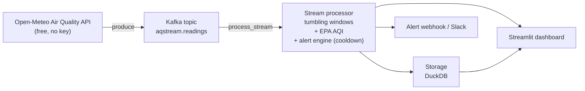

# Real-time air-quality streaming & alerting — Cameroon cities

[](https://github.com/mbongowo/Data-science-Portfolio/actions/workflows/ci.yml)
[](https://www.python.org/)
[](https://github.com/astral-sh/ruff)
[](LICENSE)

A streaming pipeline that turns hourly PM2.5 / PM10 readings for Cameroon cities
into **US-EPA AQI**, aggregates them over tumbling time windows, and runs an
**alert engine** that fires when pollution crosses WHO/EPA thresholds or spikes —
with a **per-(station, rule) cooldown** so a sustained exceedance does not
alert-storm. The AQI, windowing and alert logic are a pure-Python core anyone can
read and test; the Kafka + Spark layer runs the same logic at scale behind a
lazily imported boundary.

Inspired by [`damklis/DataEngineeringProject`](https://github.com/damklis/DataEngineeringProject),
a clean *source → processing → storage → serving* streaming reference. This
project makes it its own: an **air-quality** domain with an **alerting** feature
for Cameroon cities, fed by the free **Open-Meteo Air Quality API**.

---

## Result first

**Question.** Across four Cameroon stations over four days, **when should the
system raise an air-quality alert**, and does the alert engine stay quiet during
a sustained episode instead of firing on every reading?

**Answer.** A planted multi-hour pollution episode at Garoua (a harmattan
dust / biomass-smoke surge) pushes PM2.5 to ~95 µg/m³ and the AQI into the
**Unhealthy** band — and the engine catches it: the first crossing and the spike
fire, while the long tail of the same exceedance is **suppressed by the
cooldown**. The numbers below come from `python -m aqstream.cli demo`, which
drives the **real** core (`tumbling_aggregate` → `aqi_from_pollutants` →
`AlertEngine`) over a **seeded synthetic** stream (`seed=0`). They are fully
reproducible in under a second and pinned by a test:

```
readings            : 384 across 4 stations (hourly, 4 days)
stations            : Douala, Yaounde, Bamenda, Garoua
alerts fired        : 51
suppressed (cooldown): 187      (sustained-exceedance repeats, 6 h cooldown)
peak AQI            : 173  at Garoua
worst category      : Unhealthy
```

### Reproduce

```bash
python -m aqstream.cli demo      # writes outputs/{alerts,hourly_aqi}.csv + summary.json
```

These are **real numbers from a small, seeded synthetic demo**, designed to be
regenerated in seconds and pinned by a test so the figures above stay honest. The
full Kafka + Spark pipeline applies the **identical** AQI, windowing and alert
logic to a real, high-volume stream; only the data source and scale differ.

---

## Problem

Cameroon's cities see real air-quality swings: the dry-season **harmattan**
carries Saharan dust south, and **biomass burning** (cooking fires, land
clearing, refuse) lifts particulate matter, often for hours at a time. Ground
sensors are sparse, so a streaming pipeline over a modelled feed is a practical
way to watch PM2.5 / PM10, convert it to an interpretable index, and **alert when
it matters** — without paging someone every hour of a day-long episode.

---

## Architecture



The interpretation-critical core — `aqi.py`, `windows.py`, `alerts.py` — is plain
Python plus numpy/pandas, with **no streaming engine**. The Kafka producer/
consumer and the Spark Structured Streaming job live in `stream.py`; every
`kafka` / `pyspark` import is **inside** a function, so the package imports for
free and the test suite never touches the streaming stack. `ingest.py`
(`requests`), `sink.py` (`duckdb`) and `notify.py` (webhook) are guarded the same
way.

```
src/aqstream/
  aqi.py        # pm25_to_aqi, pm10_to_aqi, aqi_from_pollutants, aqi_category  (pure)
  windows.py    # tumbling_aggregate, rolling_mean, dedupe                      (pure)
  alerts.py     # threshold/spike/category rules + AlertEngine (cooldown)       (pure) — the star
  ingest.py     # fetch_open_meteo_aq (lazy requests) + parse_aq (pure)
  stream.py     # Kafka produce + Spark process_stream                          (guarded)
  sink.py       # store_readings / store_alerts in DuckDB                       (guarded)
  notify.py     # send_webhook / Slack / log notifier                           (guarded)
  demo.py       # run_demo: seeded synthetic stream driving the real core       (numpy/pandas)
  cli.py        # `aqstream` console entry point (argparse, lazy imports)
```

---

## How to run

### Free / local

The demo and the test suite need only numpy, pandas and pyyaml — no Kafka, no
Spark, no network:

```bash
python -m venv .venv && . .venv/bin/activate   # Windows: .venv\Scripts\activate
pip install -r requirements.txt
pip install -e .

python -m aqstream.cli demo                    # reproduce the result numbers
```

For the **live local stack** (Open-Meteo → Kafka → processor → DuckDB →
Streamlit), use docker-compose — this is the heavy path:

```bash
docker compose up        # Redpanda broker + producer + processor + dashboard
# dashboard at http://localhost:8501
```

### Azure (opt-in, costs money)

The cloud path swaps the local broker for **Azure Event Hubs** (Kafka-compatible)
and runs the processor as an Azure Container App or Stream Analytics. **Nothing
is ever deployed automatically.** See [`azure/README.md`](azure/README.md) for
the prominent cost warning, the free `what-if` validation, and the opt-in deploy/
teardown steps.

---

## Alerting design

The alert engine ([`alerts.py`](src/aqstream/alerts.py)) is the differentiated
core. It applies a set of **rules** per station and emits an `Alert`
(`station, ts, rule, value, severity, message`) when a rule fires.

**Rules**

- **Threshold** — `threshold_alert(value, threshold)` fires when a value crosses
  a fixed limit. The demo uses the **WHO 2021 PM2.5 24-hour guideline of
  15 µg/m³** (severity 2).
- **AQI category** — `aqi_category_alert(aqi)` fires when the EPA category reaches
  **Unhealthy for Sensitive Groups or worse** (AQI ≥ 101).
- **Spike** — `spike_alert(series, z=3.0)` flags a reading sitting `z` standard
  deviations above its trailing rolling mean — a sudden surge (harmattan dust,
  a burning episode), even before the absolute level is extreme (severity 3).

**Severities** are ordinal (larger is worse): threshold = 2, spike = 3.

**WHO / EPA thresholds** — WHO guidelines define the *threshold* rule; the
US-EPA breakpoint tables (documented in [`aqi.py`](src/aqstream/aqi.py)) define
the AQI and its categories.

**Cooldown / debounce** — `AlertEngine(rules, cooldown_s)` remembers the last
fire time per `(station, rule)`. A repeat firing of that pair with
`ts < last + cooldown_s` is **suppressed and counted**, not emitted; a firing once
the cooldown has lapsed re-fires. This is why a day-long Garoua episode produces a
handful of alerts, not one per hour — in the demo, **51 fired, 187 suppressed**.
Stations are independent: an alert at Douala never silences one at Yaoundé.

---

## Use your own stations / pollutant

The four Cameroon stations, their coordinates, the WHO/EPA thresholds, the window
width, the spike `z`, and the cooldown all live in
[`config/config.yaml`](config/config.yaml). To watch a different city, add a
`{name, lat, lon}` entry; the live producer polls Open-Meteo for each. To alert on
PM10 instead of (or as well as) PM2.5, point a threshold rule at the `pm10` field
and feed `aqi_from_pollutants(pm25, pm10)` — it already takes the **max** of the
sub-indices. To change sensitivity, edit `spike.z` (lower = more sensitive) or
`alerts.cooldown_seconds` (lower = more frequent alerts). The demo synthesises its
own seeded stream, so it ignores this file; the live pipeline reads it.

---

## Results

From `python -m aqstream.cli demo` (`seed=0`), verified in CI:

| metric | value |
| --- | --- |
| readings | 384 (4 stations × 96 hours) |
| alerts fired | 51 |
| alerts suppressed by cooldown | 187 |
| peak AQI | 173 (Garoua) |
| worst category | Unhealthy |

The planted Garoua episode fires a **PM2.5 spike alert** (~92 µg/m³) and the
window AQI peaks at **173 (Unhealthy)**; the WHO-threshold rule fires across the
urban stations whose baseline already exceeds 15 µg/m³, and the cooldown absorbs
the sustained repeats (the 187 suppressions). Artifacts: `outputs/alerts.csv`,
`outputs/hourly_aqi.csv`, `outputs/summary.json`.

---

## Limitations

- **Modelled, not sensor-measured.** Open-Meteo's air-quality fields are model
  output, not a reading from a ground monitor in that city; treat absolute levels
  as indicative.
- **AQI is a US standard.** The EPA AQI and its breakpoints were designed for the
  United States; applying them to Cameroon is a convenient, interpretable choice,
  not an officially sanctioned local index. WHO guideline values differ from the
  EPA AQI bands.
- **Threshold heuristics.** The WHO 15 µg/m³ line, the `z=3` spike rule and the
  6-hour cooldown are sensible defaults, not tuned to local data; they are config
  knobs, not facts.
- **No backfill.** The pipeline is forward-only: it does not reprocess history or
  late-correct an already-emitted window, and a missed window is simply absent.
- **Synthetic demo.** The pinned numbers come from a seeded synthetic stream with
  a deliberately planted spike, so the alerting behaviour is demonstrable and
  reproducible — they are not measurements of real Cameroon air.

---

## License

MIT © 2026 Joseph Mbuh
