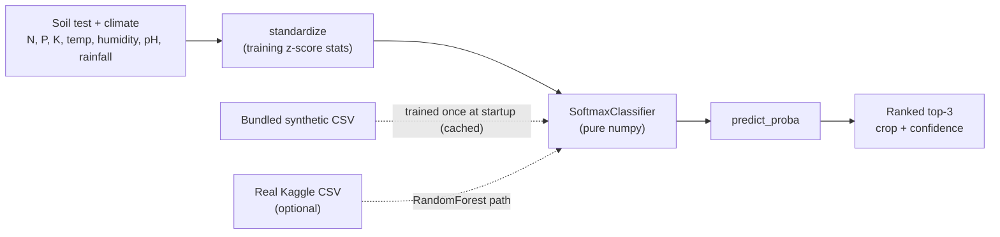

# Crop Recommender — a deployable ML web app (soil & climate -> best crop)

[](https://github.com/mbongowo/Data-science-Portfolio/actions/workflows/ci.yml)
[](https://www.python.org/)
[](https://github.com/astral-sh/ruff)
[](LICENSE)
[](https://share.streamlit.io/deploy?repository=mbongowo/Data-science-Portfolio&branch=main&mainModule=non-spatial/04-ml-web-app/app/streamlit_app.py)

**▶ Live demo:** <https://mbongowo-data-s-non-spatial04-ml-web-appappstreamlit-app-l5yxjk.streamlit.app/>
> Streamlit Community Cloud (free tier — it sleeps after inactivity, so the first load may take a few seconds to wake).

Given soil nutrients (N, P, K), temperature, humidity, soil pH and rainfall, this
app recommends the **best crop** with a **ranked top-3 and confidences**. The
runnable, CI-tested model is a **pure-numpy multinomial (softmax) classifier**
the app trains itself at startup on a bundled sample dataset — so the deployed
app needs only numpy / pandas / streamlit and works with no pre-trained binary.
A stronger scikit-learn RandomForest on the real Kaggle dataset is a documented
optional path.

Inspired by [`shsarv/Machine-Learning-Projects`](https://github.com/shsarv/Machine-Learning-Projects),
a collection of end-to-end ML apps. This project makes it its own: a
**Cameroon-framed** crop-recommendation web app with a transparent,
hand-readable numpy core and a one-click Streamlit deploy.

---

## Result first

**Question.** From a field's soil test and local climate, **which crop should a
smallholder plant**, and how confident is that call?

**Answer.** A pure-numpy softmax classifier trained on a seeded synthetic dataset
of ten Cameroon-relevant crops recovers the right crop on held-out fields most of
the time, and almost always has it in its top-3. The numbers below come from
`python -m croprec.cli demo`, which drives the **real** core (synthesise ->
stratified split -> standardise -> `SoftmaxClassifier` -> metrics) over a
**seeded synthetic** dataset (`seed=0`). They are fully reproducible in under two
seconds and pinned by a test:

```
samples            : 800  (10 crops x 80 fields)
crops              : maize, cassava, plantain, cocoa, groundnut,
                     rice, sorghum, yam, beans, oil_palm
features           : 7  (N, P, K, temperature, humidity, ph, rainfall)
test accuracy      : 0.8958
test macro-F1      : 0.8942
test top-3 accuracy: 0.9875
```

### Reproduce

```bash
python -m croprec.cli demo      # writes outputs/confusion_matrix.csv + metrics.json
```

These are **real numbers from a small, seeded synthetic demo**, designed to be
regenerated in seconds and pinned by a test so the figures above stay honest. The
optional RandomForest path applies the same pipeline to the **real** Kaggle
dataset; only the data and model differ.

---

## Problem

Choosing what to plant is one of the highest-stakes decisions a smallholder
makes, and it turns on conditions a soil test and a weather record can measure:
how much nitrogen, phosphorus and potassium the soil holds, how warm and humid
the season runs, how acidic the soil is, and how much rain falls. This app maps
those seven numbers to a recommended crop with a ranked shortlist, so the choice
is **explainable** (you see the runners-up and their confidence) rather than a
single opaque verdict.

## Method

1. **Seven features** — `N, P, K, temperature, humidity, ph, rainfall`.
2. **Standardise** — z-score each feature on the training split; the same
   statistics transform every new field, so one sample is comparable to the
   training distribution.
3. **Softmax classifier** — pure-numpy multinomial logistic regression (stable
   softmax + cross-entropy + L2, batch gradient descent). Trains in well under a
   second and exposes `predict_proba` and `top_k`.
4. **Ranked recommendation** — the crops sorted by descending probability; the
   app shows the top-1 plus a top-3 bar chart.

**Optional stronger model.** `croprec.train.train_random_forest` fits a
scikit-learn RandomForest on the real Kaggle *Crop Recommendation* dataset
(same seven columns). It imports sklearn lazily and is never imported by the
tests, so CI stays numpy/pandas-only.



---

## Run it locally

```bash
pip install -r requirements.txt        # or: conda env create -f environment.yml
pip install -e .

python -m croprec.cli demo             # reproduce the result numbers
streamlit run app/streamlit_app.py     # launch the web app
```

The app loads the bundled synthetic CSV, trains the numpy model once (cached),
takes the seven inputs as sliders, and returns the recommended crop, a top-3 bar
chart with confidences, and the model's holdout accuracy as a trust signal.

## Deploy

[](https://share.streamlit.io/deploy?repository=mbongowo/Data-science-Portfolio&branch=main&mainModule=non-spatial/04-ml-web-app/app/streamlit_app.py)

Deploy free on **Streamlit Community Cloud**:

- **Repository**: `mbongowo/Data-science-Portfolio`
- **Branch**: `main`
- **Main file path**: `non-spatial/04-ml-web-app/app/streamlit_app.py`
- **Python version** (Advanced settings): **3.12**

Cloud installs from `app/requirements.txt` (numpy / pandas / streamlit only — the
app trains the model itself). **Live URL:**
<https://mbongowo-data-s-non-spatial04-ml-web-appappstreamlit-app-l5yxjk.streamlit.app/>

---

## Model card

- **Intended use** — decision *support* for crop choice from soil and climate
  readings. It is **not** authoritative agronomy and does not replace extension
  services, soil-lab interpretation or local knowledge.
- **Features** — `N, P, K` (soil nutrients, kg/ha), `temperature` (°C),
  `humidity` (%), `ph` (soil pH), `rainfall` (mm).
- **Model** — pure-numpy multinomial logistic regression (softmax), z-score
  standardised inputs; optional scikit-learn RandomForest on the real dataset.
- **Metrics** (seeded synthetic demo, held-out test): accuracy 0.8958, macro-F1
  0.8942, top-3 accuracy 0.9875.
- **Limitations** — the bundled model is trained on **synthetic** data with an
  illustrative crop set; real N/P/K values require an actual soil test; the model
  knows nothing about pests, market prices, seed availability or labour.

## Use your own crops / dataset

The default model is trained on the bundled synthetic CSV
(`app/sample_data/crop_samples.csv`). To use real data, supply a CSV with the
same eight columns — `N, P, K, temperature, humidity, ph, rainfall, label` —
either by replacing the bundled file (the app picks it up) or by training the
RandomForest path:

```bash
pip install scikit-learn joblib
# Kaggle: atharvaingle/crop-recommendation-dataset -> Crop_recommendation.csv
python -m croprec.cli train --csv Crop_recommendation.csv
```

The data layer (`croprec.data`) reads either dataset unchanged.

## Results

| metric | value |
| --- | --- |
| test accuracy | **0.8958** |
| test macro-F1 | **0.8942** |
| test top-3 accuracy | **0.9875** |

Reproduce with `python -m croprec.cli demo`. Live app:
<https://mbongowo-data-s-non-spatial04-ml-web-appappstreamlit-app-l5yxjk.streamlit.app/>.

## Limitations

- The bundled training data is **synthetic**, generated from per-crop feature
  centres plus noise; it demonstrates the pipeline, not real Cameroon yields.
- The crop set (ten crops) is **illustrative**, not exhaustive.
- Real soil N/P/K need a **soil test**; eyeballed values will mislead the model.
- This is **not a substitute** for agricultural extension services.

## Project layout

```
non-spatial/04-ml-web-app/
├── src/croprec/         # pure-numpy core: model, metrics, data, recommend, demo
│   ├── train.py         # optional sklearn RandomForest (lazy import)
│   └── cli.py           # `croprec demo` / `croprec train`
├── app/
│   ├── streamlit_app.py # the deployed web app
│   ├── requirements.txt # Streamlit Cloud deploy manifest
│   └── sample_data/     # bundled synthetic CSV (trained at startup)
├── tests/               # numpy/pandas-only, known-answer + pinned-demo tests
├── config/config.yaml   # feature ranges, crop list, hyperparameters
└── outputs/             # demo artifacts (gitignored)
```
