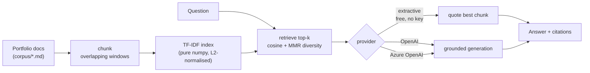

# Portfolio RAG — ask questions over my own project docs

[](https://github.com/mbongowo/Data-science-Portfolio/actions/workflows/ci.yml)
[](https://www.python.org/)
[](https://github.com/astral-sh/ruff)
[](LICENSE)
[](https://share.streamlit.io/deploy?repository=mbongowo/Data-science-Portfolio&branch=main&mainModule=non-spatial/05-focused-ml-project/app/streamlit_app.py)

A small **Retrieval-Augmented Generation (RAG)** system that answers
natural-language questions across my data-science portfolio. Each project in this
monorepo has a short markdown summary; ask *"which project detects floods from
SAR imagery?"* and the system retrieves the right project doc and answers with a
citation.

The runnable, CI-tested contribution is a **pure-Python / numpy retrieval core**:
chunk the docs, build a TF-IDF index, retrieve the top-k chunks by cosine
similarity, optionally re-rank for diversity with **Maximal Marginal Relevance
(MMR)**, and measure retrieval quality with **recall@k** and **MRR**. Answers
default to **extractive** — quote the best retrieved chunk with citations — so the
whole thing runs **free with no API key** and cannot hallucinate. Generated
answers via an LLM (OpenAI / Azure OpenAI / local transformers) are a
**pluggable, optional** provider you key when ready.

Inspired by the
[`ashishpatel26/500-AI-Machine-learning-Deep-learning-Computer-vision-NLP-Projects-with-code`](https://github.com/ashishpatel26/500-AI-Machine-learning-Deep-learning-Computer-vision-NLP-Projects-with-code)
idea bank — a broad project catalogue that flagged the NLP/LLM gap in this
portfolio. This project makes the idea its own: **RAG over my *own* portfolio
docs**, with a transparent, hand-readable retrieval core instead of a black-box
hosted index.

---

## Result first

**Question.** Across a multi-project portfolio, can a lexical TF-IDF retriever
reliably surface the *right* project document for a natural-language question —
and rank it first?

**Answer.** Yes, on the curated portfolio corpus. The numbers below come from
`python -m ragqa.cli demo`, which drives the **real** core (load corpus -> chunk
-> TF-IDF index -> retrieve top-k + MMR -> evaluate) over the bundled docs and
QA set. They are fully reproducible in well under a second and pinned by a test:

```
documents      : 14   (one markdown summary per portfolio project)
chunks         : 29   (overlapping word windows)
vocabulary     : 648  TF-IDF terms
recall@3       : 1.00 (relevant doc in the top 3 for every QA question)
MRR            : 1.00 (relevant doc ranked first for every QA question)
questions      : 14   curated (question, relevant_doc_id) pairs
```

### Reproduce

```bash
python -m ragqa.cli demo      # writes outputs/eval.json + sample_answers.json
```

These are **real numbers from the bundled corpus**, regenerated in seconds and
pinned by a test so the figures stay honest. recall@3 and MRR of 1.00 reflect a
small, well-separated corpus where each project has a distinctive vocabulary
(SAR/Otsu, PageRank, PSI drift, …); on a larger or more overlapping corpus,
lexical retrieval would not be perfect — see *Limitations*.

---

## Problem

A portfolio of two dozen projects is hard to navigate by browsing. The natural
interface is a question — *"where do you use the Population Stability Index?"*,
*"which project compares pretrained vs from-scratch transfer learning?"* — and a
direct, cited answer. That is exactly the shape of a RAG system: retrieve the
relevant source passages, then answer **grounded in** them with citations, rather
than from a model's memory.

## Method

1. **Chunk** — split each project doc into overlapping word windows so a sentence
   straddling a boundary is not lost to retrieval (stride = size − overlap).
2. **TF-IDF index** — a pure-numpy vectoriser with smoothed idf
   `idf(t) = ln((N+1)/(df(t)+1)) + 1` and L2-normalised rows, so a dot product is
   a cosine similarity.
3. **Retrieve top-k + MMR** — cosine-rank the chunks against the query, then
   optionally re-rank the top candidates with **MMR** to trade relevance against
   redundancy (`λ·sim(q,c) − (1−λ)·max sim(c,selected)`), so the contexts are
   diverse rather than near-duplicates.
4. **Answer** — **extractive** by default (quote the best chunk + list source
   doc ids), or hand the grounded contexts to an **LLM provider** for a generated
   answer that is instructed to use only those contexts and cite them.



---

## How to run

### Free (no API key)

```bash
pip install -r requirements.txt        # or: conda env create -f environment.yml
pip install -e .

python -m ragqa.cli demo               # reproduce the result numbers
python -m ragqa.cli ask "Which project maps floods from SAR imagery?"
streamlit run app/streamlit_app.py     # the chat app, extractive (no key)
```

The extractive path quotes the most relevant retrieved chunk and lists the
source docs — no model, no key, no network.

### With an LLM (optional, opt-in)

Set the keys for the provider you want (copy `.env.example` to `.env`), install
the extra, and pass `--provider`:

```bash
pip install openai
export OPENAI_API_KEY=sk-...                       # OpenAI
python -m ragqa.cli ask "..." --provider openai

# or Azure OpenAI
export AZURE_OPENAI_ENDPOINT=... AZURE_OPENAI_API_KEY=... AZURE_OPENAI_DEPLOYMENT=...
python -m ragqa.cli ask "..." --provider azure_openai
```

The LLM answer is grounded in the retrieved contexts and asked to cite sources.
**Cost note:** LLM calls are billed per token by the provider; this is purely
opt-in and the project is fully usable without it.

## Evaluation

Retrieval is the honest, measurable part of a RAG system, so it is evaluated
directly against a bundled QA set (`corpus/qa_eval.json`) of
`(question, relevant_doc_id)` pairs:

- **recall@k** — fraction of questions whose relevant document appears in the
  top `k` retrieved.
- **MRR** — mean reciprocal rank of the relevant document (1.0 = always ranked
  first).

On the bundled corpus the demo reports **recall@3 = 1.00** and **MRR = 1.00**
over 14 questions. The metrics are pinned by a test, and the same
`evaluate_retrieval` runs on any corpus + QA set you supply.

## Use your own docs

The corpus is just markdown:

1. Drop one `.md` file per document in `corpus/` (its filename stem is the
   `doc_id`; the first `# heading` is the title).
2. Add `(question, relevant_doc_id)` pairs to `corpus/qa_eval.json` to measure
   retrieval on your set.
3. Rerun `python -m ragqa.cli demo` (or the app) — the index rebuilds over your
   docs automatically.

## Deploy

[](https://share.streamlit.io/deploy?repository=mbongowo/Data-science-Portfolio&branch=main&mainModule=non-spatial/05-focused-ml-project/app/streamlit_app.py)

Deploy the extractive app free on **Streamlit Community Cloud**:

- **Repository**: `mbongowo/Data-science-Portfolio`
- **Branch**: `main`
- **Main file path**: `non-spatial/05-focused-ml-project/app/streamlit_app.py`
- **Python version** (Advanced settings): **3.12**

Cloud installs from `app/requirements.txt` (numpy / pandas / streamlit only — the
extractive RAG needs no LLM library or key). Live URL: _add after first deploy_.

## Limitations

- **TF-IDF is lexical, not semantic.** It matches words, not meaning, so a
  question phrased with different vocabulary than the doc can miss. Swapping the
  vectoriser for dense sentence embeddings would improve semantic recall.
- **LLM answers can hallucinate** beyond the provided context; the prompt pins
  the model to the retrieved passages and asks for citations, but generation is
  never as safe as the extractive quote.
- **The corpus is small** and curated, so the perfect recall@3/MRR here would not
  hold on a large, overlapping document set.
- **Extractive answers are quotes, not synthesis** — they return the best passage
  verbatim rather than composing an answer across several documents.

## Project layout

```
non-spatial/05-focused-ml-project/
├── src/ragqa/          # pure retrieval core: chunk, index, evaluate, pipeline
│   ├── generate.py     # extractive (pure) + llm_answer (lazy provider)
│   ├── corpus.py       # load markdown corpus + QA set
│   └── cli.py          # `ragqa demo` / `ragqa ask` / `ragqa index`
├── app/
│   ├── streamlit_app.py  # the deployed RAG chat app
│   └── requirements.txt  # Streamlit Cloud deploy manifest
├── corpus/             # bundled portfolio docs + qa_eval.json
├── tests/              # numpy/stdlib-only known-answer + pinned-demo tests
├── config/config.yaml  # chunk size, k, MMR lambda, provider, models
└── outputs/            # demo artifacts (gitignored)
```
