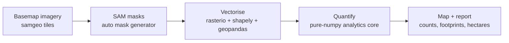

# segment-geospatial: building & field extraction (Douala, Cameroon)

[](https://github.com/mbongowo/Data-science-Portfolio/actions/workflows/ci.yml)
[](https://www.python.org/)
[](https://github.com/astral-sh/ruff)
[](LICENSE)

Turn **Segment Anything (SAM) masks** over satellite imagery into *counted,
measured* features: building count, mean footprint in square metres, and total
field area in hectares, over an area of interest in **Douala, Cameroon**.

**Inspired by and built on** [`opengeos/segment-geospatial`](https://github.com/opengeos/segment-geospatial)
(SAM applied to satellite/aerial imagery). SAM produces masks; the runnable,
tested contribution here is the **geospatial post-processing and
quantification** that turns those masks into numbers.

---

## Result first

The headline numbers below come from the **runnable demo** (`python -m
samgeo_post.cli demo`), not a hand-picked example. The demo deterministically
synthesises a small label raster that stands in for a SAM output — a 5x5 grid of
rectangular building footprints (sizes jittered with `seed=0`) plus one large
field — at a basemap-realistic 0.5 m/pixel, then drives the **real pure-numpy
core**: connected-component labelling, region properties, area filtering into a
building-size band, and pixel-to-metre/hectare conversion.

```
synthetic-demo numbers, reproducible via `python -m samgeo_post.cli demo`
seed = 0, raster = 120x120, pixel size = 0.5 m/px

objects found (labelled)     : 26
buildings (size band)        : 25
mean building footprint      : 26.77 m^2
total building area          : 669.25 m^2
field area                   : 0.0575 ha
reconstruction IoU sanity    : 1.000   (labelling round-trips the input mask)
```

These are the **real** outputs of the pure-numpy core on a **small seeded
synthetic raster** — honest about being synthetic, but reproducible to the
digit. The live Douala SAM run (notebook below) uses the *same* analytics core
on real masks; only the mask source changes.

**Reproduce:**

```bash
python -m samgeo_post.cli demo     # writes outputs/region_props.csv + outputs/summary.json
```

---

## The problem

Mapping informal and rapidly-growing urban areas like Douala by hand is slow,
and authoritative building/field layers are often missing or out of date. SAM
can segment objects in a basemap with no training, but a raw mask is just
pixels: it does not tell you *how many* buildings there are, *how big* they are,
or *how much* land a field covers. This project fills that gap — the
quantification step between "SAM mask" and "a number you can report".

## Method

1. **Basemap imagery** — pull satellite tiles for the Douala AOI with `samgeo`.
2. **SAM masks** — run SAM automatic mask generation to an integer-labelled
   raster (one integer per object).
3. **Vectorise** — polygonise the labelled raster to GeoJSON with per-polygon
   area.
4. **Quantify** — the pure-numpy core: label connected components, compute
   region properties (area, bbox, centroid), filter to a building-size band in
   m², and total field area in hectares.
5. **Map** — overlay extracted footprints/fields on the basemap for inspection.



Steps 1-3 need a GPU and the geospatial stack. **Step 4 — the contribution — is
pure numpy**, fully unit-tested, and is what the demo and the notebook's
quantification cell both call.

### The core (pure numpy, no third-party deps)

`src/samgeo_post/analytics.py` is the tested core:

- `label_components(mask, connectivity=4|8)` — BFS flood-fill connected-component
  labelling.
- `region_props(labeled)` — per-object `label`, `area_px`, `bbox`, `centroid`.
- `count_objects`, `filter_by_area(min_px, max_px)` — drop speckle and oversized
  blobs.
- `pixels_to_area(area_px, pixel_size_m)`, `area_hectares(area_m2)` — exact unit
  conversion.
- `mask_iou(a, b)` — intersection-over-union for validation.

Every function has a **hand-derived known-answer test** (two separated squares
give 2 components; a diagonal-touching pair is 2 under 4-connectivity and 1
under 8; a known rectangle's bbox/centroid; area filtering drops a 1-px speckle
and a huge blob; `pixels_to_area`/`area_hectares` exact; `mask_iou` of two
half-overlapping masks is 1/3). The SAM wrapper (`segment.py`) and the
vectoriser (`vectorize.py`) import their heavy dependencies lazily, inside
functions, so neither the core nor the test suite needs the geospatial or
deep-learning stack.

---

## Run it

### The analytics core, demo, and tests (local, numpy only)

```bash
python -m venv .venv && . .venv/bin/activate   # Windows: .venv\Scripts\activate
pip install -r requirements.txt                # core needs only numpy/pandas/pyyaml
pip install -e .

python -m samgeo_post.cli demo                 # reproduces the numbers above

# tests (numpy + stdlib only):
#   PowerShell:  $env:PYTHONPATH="src"; python -m pytest tests -q
#   bash:        PYTHONPATH=src python -m pytest tests -q
```

### The live Douala SAM run (Colab / GPU)

The full SAM pipeline is heavy (`torch` + a CUDA GPU; large checkpoint). Run
`notebooks/01_segment_douala.ipynb` on **Google Colab with a GPU runtime** or a
local GPU box. Install the full stack with the conda env (recommended for
GDAL/GEOS/PROJ + PyTorch):

```bash
conda env create -f environment.yml
conda activate segment-geospatial
```

CLI equivalents for the heavy steps:

```bash
samgeo-post segment --config config/aoi.yaml                 # imagery -> SAM masks .tif
samgeo-post vectorize --config config/aoi.yaml --mask outputs/douala_masks.tif
```

---

## Results

### Synthetic demo (reproducible, numpy only)

| metric                     | value      |
| -------------------------- | ---------- |
| objects found              | 26         |
| buildings (size band)      | 25         |
| mean building footprint    | 26.77 m^2  |
| total building area        | 669.25 m^2 |
| field area                 | 0.0575 ha  |
| reconstruction IoU         | 1.000      |

### Live Douala SAM run (fill in after running the notebook)

Run `notebooks/01_segment_douala.ipynb` on the Douala AOI and record the
numbers here. Placeholder pending a GPU run:

| metric                  | value (TODO) |
| ----------------------- | ------------ |
| building count          | _TODO_       |
| mean footprint (m^2)    | _TODO_       |
| total field area (ha)   | _TODO_       |
| AOI bbox                | 9.65–9.80 E, 4.00–4.10 N |
| basemap / zoom          | Satellite / 19 |

---

## Configuration

Everything analysis-defining lives in [`config/aoi.yaml`](config/aoi.yaml): the
Douala bbox, basemap source/zoom, pixel size, connectivity, and the
building/field area thresholds in m². The dependency-free demo ignores this file
and uses its own fixed synthetic geometry.

### Use your own area of interest

The repo ships with a **Douala default so it runs out of the box**, but it is
built to point anywhere. To replicate on your own region, edit only the `aoi`
block in [`config/aoi.yaml`](config/aoi.yaml):

- set `bbox` (`min_lon / min_lat / max_lon / max_lat`, EPSG:4326) to your area —
  keep it a few km across so the SAM tile pull stays tractable;
- set `crs` to your local UTM zone for area-correct measurement (look it up at
  [epsg.io](https://epsg.io));
- tune `basemap.zoom` / `analysis.pixel_size_m` to the imagery resolution and the
  `building_min/max_area_m2` thresholds to local building sizes.

Nothing else changes: `segment`, `vectorize`, and the quantification core all
read the AOI from this one file.

---

## Limitations

- **SAM over-segments / under-segments.** Adjacent buildings merge; shadows and
  roof texture split a single roof. The area band filters some of this but not
  all.
- **Basemap, not a true ortho.** Tile imagery has building lean and seam
  artefacts; footprints are approximate and the 0.5 m/px pixel size is nominal.
- **No per-class labels.** SAM is class-agnostic. "Building" vs "field" here is
  inferred purely from the area band, not a trained classifier.
- **Validation needed.** Counts and areas should be checked against
  OpenStreetMap buildings or a local cadastre for the same AOI (using `mask_iou`
  and footprint-count agreement) before being reported as fact.

---

## License

MIT © 2026 Joseph Mbuh
