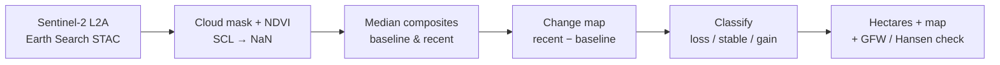

# earth-engine-timeseries: multi-year vegetation change & forest-loss detection (Cameroon)

[](https://github.com/mbongowo/Data-science-Portfolio/actions/workflows/ci.yml)
[](https://www.python.org/)
[](https://github.com/astral-sh/ruff)
[](LICENSE)

Turn a **multi-year Sentinel-2 time series** into *forest-change numbers*: a
per-period NDVI series, cloud-robust baseline and recent composites, a bitemporal
change map, a loss/stable/gain classification, hectares of loss and gain, and
burn severity (dNBR) — over a forest area of interest in **Cameroon**.

**Inspired by** [`giswqs/geemap`](https://github.com/giswqs/geemap) (cloud remote
sensing and spectral-index time series with Google Earth Engine). The key design
choice here: the runnable, CI-tested, reproducible path is **Earth-Engine-free**.
It pulls Sentinel-2 L2A from the open **Earth Search STAC** catalogue with **no
authentication** — no Google account, no sign-in, no API key. The geemap / Earth
Engine route is included as a documented **optional** path you authenticate when
ready (`eets.gee`, `notebooks/02_geemap_change.ipynb`).

This sits alongside two sibling projects and does something different:
`eo-monitor` does single-date index + anomaly; `disturbance-detection` does
per-pixel harmonic + breakpoint; **this** does multi-year index **time series** +
**bitemporal change detection** (before/after composites → change map → classify
loss/gain → hectares) + **dNBR burn severity**, validated against an external
report (Global Forest Watch / Hansen tree-cover loss).

---

## Result first

The headline numbers below come from the **runnable demo** (`python -m
eets.cli demo`), not a hand-picked example. The demo deterministically
synthesises a small multi-year Sentinel-2-like NDVI stack — intact forest in the
baseline years, then a rectangular **planted clearing** that appears in the
recent years (NDVI drops there), with mild per-scene noise and scattered
synthetic "cloud" pixels masked out via a scene-classification layer (SCL). It
then drives the **real pure-numpy core**: the spatial-mean NDVI time series
(which dips when the clearing appears), baseline vs recent median composites, the
change map, the loss/gain classification, and the hectares.

```
synthetic-demo numbers, reproducible via `python -m eets.cli demo`
seed = 0, raster = 80x80, pixel size = 10 m/px, 12 scenes (6 baseline + 6 recent)

baseline mean NDVI           : 0.8501
recent mean NDVI             : 0.7655   (drops — the clearing appears)
planted clearing             : 9.00 ha  (30 x 30 px ground truth)
detected loss                : 9.00 ha
detected gain                : 0.00 ha
planted clearing recovered   : 1.000    (fraction of the block flagged as loss)
```

These are the **real** outputs of the pure-numpy core on a **small seeded
synthetic stack** — honest about being synthetic, but reproducible to the digit.
The median composite removes the scattered clouds cleanly, so the detector
recovers the full 9 ha clearing. The live Cameroon run (notebook below) uses the
*same* core on real Sentinel-2 composites; only the data source changes.

**Reproduce:**

```bash
python -m eets.cli demo     # writes outputs/change_stats.json + outputs/index_timeseries.csv
```

---

## The problem

Forest loss in the Congo Basin happens in patches — selective clearing, new
plantations, roadside conversion — that are easy to miss between annual reports.
A single satellite date is too noisy and too cloud-prone to trust over equatorial
forest. The robust signal is in the **time series**: build a cloud-free composite
for a baseline period and another for a recent period, difference them, and the
places where greenness dropped are your candidate loss. This project is that
pipeline, end to end, from open Sentinel-2 to hectares you can put in a table and
check against an independent source.

## Method

1. **Sentinel-2 L2A from STAC** — search Earth Search for scenes over the AOI and
   each period (auth-free).
2. **Cloud-mask + index** — drop cloud/shadow/snow pixels with the SCL, compute
   NDVI per scene (masked pixels become NaN, never 0).
3. **Composites** — per-pixel **median** over each period → a baseline image and
   a recent image, robust to residual cloud.
4. **Change** — `change_map` = recent − baseline → `classify_change` (loss /
   stable / gain) → `change_stats` (hectares).
5. **Burn severity (optional)** — `dnbr` = pre − post NBR →
   `classify_burn_severity` (USGS classes) → `severity_stats` (hectares/class).
6. **Validate** — compare the loss total to Global Forest Watch / Hansen
   tree-cover loss for the same AOI.



Steps 1-2 need the geospatial stack. **Steps 3-5 — the contribution — are pure
numpy**, fully unit-tested, and are exactly what the demo and the notebooks'
quantification cells call.

### The core (pure numpy, no third-party deps)

- `eets.indices` — `normalized_difference`, `ndvi`, `ndwi`, `nbr` (division by
  zero → NaN, so masked pixels never read as a real index value).
- `eets.timeseries` — `index_timeseries` (per-step spatial mean, NaN-aware),
  `temporal_composite` (per-pixel median/mean over a period), `mask_invalid`
  (SCL cloud masking).
- `eets.change` — `change_map`, `classify_change`, `change_stats` (hectares),
  `dnbr`, `classify_burn_severity` (USGS thresholds), `severity_stats`.

Every function has a **hand-derived known-answer test** (NDVI of known bands; 0/0
→ NaN; spatial means and temporal medians on tiny stacks; SCL masking; change
deltas and thresholds; hectares from a known classified array; dNBR values
straddling the USGS break points). The STAC path (`eets.stac`) and the Earth
Engine path (`eets.gee`) import their heavy dependencies lazily, inside
functions, so neither the core nor the test suite needs the geospatial or Earth
Engine stack.

---

## Run it

### The core, demo, and tests (local, numpy only)

```bash
python -m venv .venv && . .venv/bin/activate   # Windows: .venv\Scripts\activate
pip install -r requirements.txt                # core needs only numpy/pandas/pyyaml
pip install -e .

python -m eets.cli demo                        # reproduces the numbers above

# tests (numpy + stdlib only):
#   PowerShell:  $env:PYTHONPATH="src"; python -m pytest tests -q
#   bash:        PYTHONPATH=src python -m pytest tests -q
```

### The live Cameroon run from STAC (auth-free)

`notebooks/01_stac_change.ipynb` is the default workflow: load Sentinel-2
baseline and recent composites for the Cameroon AOI from Earth Search, compute
NDVI change, classify, map a before/after split, quantify hectares, and compare
to Global Forest Watch / Hansen. **No Earth Engine account needed.** Install the
geospatial stack with the conda env (recommended for GDAL/GEOS/PROJ):

```bash
conda env create -f environment.yml
conda activate ee-timeseries
```

CLI equivalents for the heavy steps:

```bash
eets timeseries --config config/aoi.yaml --start 2023-01-01 --end 2024-12-31
eets change --config config/aoi.yaml          # baseline vs recent loss/gain hectares
```

### The optional geemap / Earth Engine run

`notebooks/02_geemap_change.ipynb` is the same analysis on Earth Engine, included
for parity with `geemap`. It needs a one-time free sign-in:

```bash
pip install earthengine-api geemap
earthengine authenticate
```

This path is **not** required — it is the convenience alternative if you already
use Earth Engine.

---

## Results

### Synthetic demo (reproducible, numpy only)

| metric                        | value     |
| ----------------------------- | --------- |
| scenes (baseline + recent)    | 6 + 6     |
| baseline mean NDVI            | 0.8501    |
| recent mean NDVI              | 0.7655    |
| planted clearing (ground truth) | 9.00 ha |
| detected loss                 | 9.00 ha   |
| detected gain                 | 0.00 ha   |
| planted clearing recovered    | 1.000     |

### Live Cameroon run (fill in after running the notebook)

Run `notebooks/01_stac_change.ipynb` on the AOI and record the numbers here,
including the validation row against Global Forest Watch tree-cover loss for the
same bbox and window. Placeholder pending a live run:

| metric                              | value (TODO)            |
| ----------------------------------- | ----------------------- |
| baseline period                     | 2018-2019               |
| recent period                       | 2023-2024               |
| NDVI loss (Sentinel-2, this repo)   | _TODO_ ha               |
| NDVI gain (Sentinel-2, this repo)   | _TODO_ ha               |
| **GFW / Hansen tree-cover loss**    | _TODO_ ha (validation)  |
| agreement (S2 vs GFW)               | _TODO_ %                |
| AOI bbox                            | 13.50–13.60 E, 3.30–3.40 N |

The GFW / Hansen row is the external credibility check: agreement within a
reasonable margin supports the NDVI-change total; a large gap points at threshold
sensitivity or cloud contamination (see Limitations).

---

## Configuration

Everything analysis-defining lives in [`config/aoi.yaml`](config/aoi.yaml): the
Cameroon bbox, the local UTM CRS, the baseline and recent periods, the index, the
loss/gain thresholds, the pixel size, and the cloud limits. The dependency-free
demo ignores this file and uses its own fixed synthetic scene.

### Use your own area of interest

The repo ships with a **south-eastern Cameroon forest default so it runs out of
the box**, but it is built to point anywhere. To replicate on your own region,
edit only the relevant blocks in [`config/aoi.yaml`](config/aoi.yaml):

- set `aoi.bbox` (`min_lon / min_lat / max_lon / max_lat`, EPSG:4326) to your
  area — keep it a few km across so the STAC load stays tractable;
- set `aoi.crs` to your local UTM zone for area-correct measurement (Cameroon is
  EPSG:32632 in the west, EPSG:32633 in the east; look others up at
  [epsg.io](https://epsg.io));
- set `baseline_years` / `recent_years` to the periods you want to compare;
- tune `analysis.index`, `loss_thresh` / `gain_thresh`, and `max_cloud` to your
  target and local cloudiness.

Nothing else changes: `timeseries`, `change`, and the quantification core all
read the AOI from this one file.

---

## Limitations

- **Composite cloud contamination.** Over perennially cloudy equatorial forest
  even a median composite can retain haze or thin cloud, biasing NDVI; widen the
  period or lower `max_cloud`.
- **Threshold sensitivity.** The loss/gain hectares move with `loss_thresh` /
  `gain_thresh`; report a sensitivity range, not a single number.
- **Sentinel-2 starts ~2015 (global ~2017).** Long baselines (1990s-2000s) need
  Landsat, which has coarser resolution and different band characteristics.
- **MAUP.** Pixel-counted hectares depend on the grid and pixel size; aggregated
  totals can shift with resolution and AOI boundary (the modifiable areal unit
  problem).
- **Validation needed.** NDVI change is a proxy, not ground truth: seasonal
  phenology, agriculture, and water-level change all move NDVI. Always cross-check
  against Global Forest Watch / Hansen or field data before reporting a number as
  deforestation.

---

## License

MIT © 2026 Joseph Mbuh
