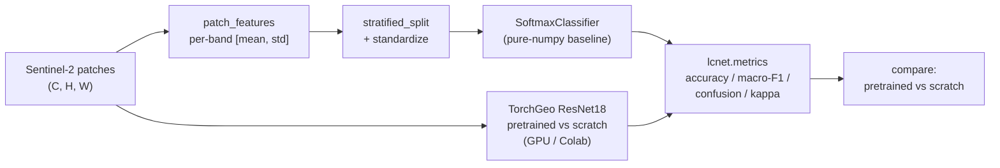

# torchgeo-landcover

[](https://github.com/mbongowo/Data-science-Portfolio/actions/workflows/ci.yml)
[](pyproject.toml)
[](LICENSE)
[](https://github.com/microsoft/torchgeo)

**Whole-patch land-cover classification (EuroSAT-style), pretrained vs from-scratch.**

Two things live here. A **pure-numpy classification stack** — a from-scratch
trainable softmax baseline, a full metrics suite, and the imagery-to-feature
bridge — that runs and is tested without a GPU. And a documented **TorchGeo
ResNet18 fine-tune on EuroSAT** (pretrained vs from-scratch) that needs a
GPU/Colab and whose numbers drop into the model card below. The split is
deliberate: the part that decides *what a number means* (the metrics, the split,
the baseline) is reproducible on a bare machine; the part that needs hardware is
honest about needing it.

This is **classification**, not segmentation: each Sentinel-2 patch gets one
land-cover label. (The sibling `spatial/geoai-segmentation` does per-pixel
segmentation.)

---

## Result first

The pure-numpy baseline, reproducible right now with `python -m lcnet.cli demo`
(no GPU, no downloads, < 2 s). It synthesises an EuroSAT-like dataset — 480
multispectral patches, 6 land-cover classes, each with a distinct per-band
spectral signature plus per-sample and pixel noise — featurises each patch to a
per-band `[mean, std]` vector, does a stratified split, standardizes on the
training statistics, trains the softmax classifier, and evaluates on the
held-out test split.

```text
$ python -m lcnet.cli demo        # seed=0
n_samples        480
n_classes        6
n_features       12        (6 bands x [mean, std])
test_accuracy    0.885
test_macro_f1    0.882
test_micro_f1    0.885
cohen_kappa      0.863
top-2 accuracy   1.000
per-class F1     [0.778, 0.667, 1.000, 0.938, 0.938, 0.970]
```

Writes `outputs/confusion_matrix.csv` and `outputs/metrics.json`. The numbers
are seeded and pinned in `tests/test_demo.py`, so "reproducible" is enforced,
not aspirational. Accuracy sits in the mid-0.8s by design: the class signatures
overlap once noise is added, so the linear baseline has real errors to make
rather than a trivial 1.0.

A guided version — training curve, confusion matrix, and the same `lcnet.metrics`
reused on the deep model — is in
[`notebooks/01_torchgeo_eurosat.ipynb`](notebooks/01_torchgeo_eurosat.ipynb).

---

## Problem

Land-cover mapping assigns each location a class (forest, cropland, water,
built-up, ...). On Sentinel-2 the common benchmark framing is **EuroSAT**:
small 64×64 patches, each labelled with one of 10 land-cover classes. The
question this project answers in a measurable way: **how much does ImageNet
pretraining buy you on a small remote-sensing dataset**, against a model trained
from scratch, scored with the same metric code?

## Inspired by `microsoft/torchgeo`

The deep-learning path is built on **[microsoft/torchgeo](https://github.com/microsoft/torchgeo)**
(MIT) — its EuroSAT dataset loader, geospatial samplers, and pretrained model
weights. Credit to the TorchGeo authors. This repo is my own work around it: the
pure-numpy baseline + metrics + comparison framework are original, and TorchGeo
supplies the real dataset and pretrained weights for the GPU fine-tune.

## Method

1. **Featurise.** `patch_features` reduces a `(C, H, W)` multispectral patch to a
   per-band `[mean, std]` vector — the per-band mean carries the spectral
   signature that separates classes, the std carries texture. This is the bridge
   from imagery to a tabular classifier.
2. **Split.** `stratified_split` gives a deterministic train/val/test split with
   every class represented in every split.
3. **Standardize.** Zero-mean/unit-variance on the *training* statistics, applied
   unchanged to val/test (no leakage).
4. **Baseline.** `SoftmaxClassifier` — multinomial logistic regression by batch
   gradient descent on a numerically stable cross-entropy, with L2. Pure numpy.
5. **Score.** `lcnet.metrics` — confusion matrix, accuracy, per-class
   precision/recall/F1, macro/micro F1, Cohen's kappa, top-k accuracy.
6. **Deep model (GPU/Colab).** `lcnet.train` fine-tunes a TorchGeo ResNet18 on
   EuroSAT, **pretrained vs from-scratch**, and scores it with the *same*
   `lcnet.metrics` so the comparison is apples-to-apples.



---

## How to run

**Pure-numpy core + demo + tests (no GPU, no data):**

```bash
pip install -r requirements.txt   # only numpy/pandas/pyyaml are needed for this
pip install -e .

python -m lcnet.cli demo          # writes outputs/{confusion_matrix.csv, metrics.json}

# Tests (bare machine, numpy only):
PYTHONPATH=src python -m pytest tests -q
# Windows PowerShell:
#   $env:PYTHONPATH="src"; python -m pytest tests -q
```

**Real EuroSAT fine-tune (GPU / Colab):** install the full stack
(`requirements.txt` includes torch/torchvision/torchgeo, or use
`environment.yml`), then either run the notebook on a Colab GPU runtime or:

```bash
lcnet train --pretrained --epochs 10      # ImageNet-pretrained ResNet18
lcnet train --no-pretrained --epochs 10   # from scratch
lcnet compare --epochs 10                 # both, side by side
```

EuroSAT downloads automatically through TorchGeo on first use.

---

## Model Card

**Model.** Two interchangeable models scored by the same metric code: (1) a
pure-numpy softmax (multinomial logistic regression) baseline on per-band
[mean, std] features; (2) a TorchGeo ResNet18 fine-tuned on EuroSAT RGB,
optionally ImageNet-pretrained.

**Intended use.** A reproducible, teaching-grade reference for land-cover patch
classification and for quantifying the value of transfer learning on a small
remote-sensing dataset. Not an operational land-cover product.

**Training data.** The baseline trains on a *synthetic* EuroSAT-like dataset
(seeded multispectral patches with per-class spectral signatures). The deep
model trains on **EuroSAT** (Sentinel-2 L2A patches, 10 land-cover classes), via
TorchGeo.

**Baseline metrics (numpy, synthetic, seed=0, held-out test split):**

| Metric            | Value |
|-------------------|-------|
| accuracy          | 0.885 |
| macro F1          | 0.882 |
| micro F1          | 0.885 |
| Cohen's kappa     | 0.863 |
| top-2 accuracy    | 1.000 |

Per-class F1: `0.778, 0.667, 1.000, 0.938, 0.938, 0.970`.

**Live TorchGeo results (fill after the GPU run — `lcnet compare`):**

| Setting             | Test accuracy | Test macro F1 |
|---------------------|---------------|---------------|
| ResNet18 pretrained | _TBD_         | _TBD_         |
| ResNet18 scratch    | _TBD_         | _TBD_         |

> Pretraining typically wins clearly at low epochs / small data; record your own
> numbers here from the notebook or `lcnet compare` so the claim is yours.

**Ethics & limitations.** Land-cover models inherit the geography of their
training data: a model trained on EuroSAT (mostly central-European scenes) will
not transfer cleanly to, say, Cameroonian agroforest without domain adaptation.
Mislabelling land cover can misinform land-use, conservation, or policy
decisions; treat outputs as decision support, not ground truth.

---

## Use your own dataset / classes

The default is EuroSAT (10 classes, RGB Sentinel-2). To change it:

- **Another TorchGeo dataset.** TorchGeo ships many classification datasets
  (e.g. `UCMerced`, `BigEarthNet`, `RESISC45`). Swap the loader in
  `lcnet.train.train_eurosat` and set `dataset.name` / `dataset.classes` in
  `config/config.yaml`. Adjust `num_classes` to match.
- **A Cameroon land-cover patch set.** Cut your own labelled patches (e.g.
  forest / cocoa-agroforest / savanna / cropland / built-up / water / bare),
  point the notebook's dataset cell at the folder, and edit
  `config/config.yaml` (`classes`, `bands`, `num_classes`). The numpy baseline
  needs nothing TorchGeo-specific: featurise patches with `patch_features` and
  feed `SoftmaxClassifier` directly.
- **More bands.** EuroSAT also offers all 13 Sentinel-2 bands. Using them with a
  pretrained ResNet means widening the first convolution; the from-scratch arm
  handles any band count directly.

---

## Project layout

```
03-torchgeo-landcover/
├── config/config.yaml            # EuroSAT dataset/model/train config (demo ignores it)
├── src/lcnet/
│   ├── metrics.py                # pure-numpy confusion matrix, accuracy, P/R/F1, macro/micro F1, kappa, top-k
│   ├── classifier.py             # pure-numpy SoftmaxClassifier (multinomial logistic regression) + standardize
│   ├── data.py                   # stratified_split, band_stats, patch_features (imagery -> features)
│   ├── demo.py                   # GPU-free demo: synth EuroSAT-like data -> baseline -> outputs/
│   ├── train.py                  # LAZY torch/torchgeo: ResNet18 EuroSAT fine-tune + pretrained-vs-scratch compare
│   └── cli.py                    # `lcnet demo` (numpy) + `train` / `compare` (GPU/Colab)
├── notebooks/01_torchgeo_eurosat.ipynb   # the real GPU workflow; reuses lcnet.metrics
├── tests/                        # KAT for metrics / classifier / data / demo (numpy only)
└── requirements.txt / environment.yml
```

---

## Limitations

- The reproducible baseline trains on **synthetic** patches, not real imagery —
  it exercises the classification stack honestly but is not a land-cover result.
- **EuroSAT is RGB/MS Sentinel-2 patches over (mostly) Europe**, not
  Cameroon-specific; expect domain shift on other regions.
- Class **imbalance** and **domain shift** both degrade real-world accuracy; the
  macro F1 and per-class F1 are reported precisely so imbalance is visible rather
  than hidden behind overall accuracy.
- The full fine-tune needs **torch + a GPU**; CPU runs are possible but slow.

## License

MIT © 2026 Joseph Mbuh
