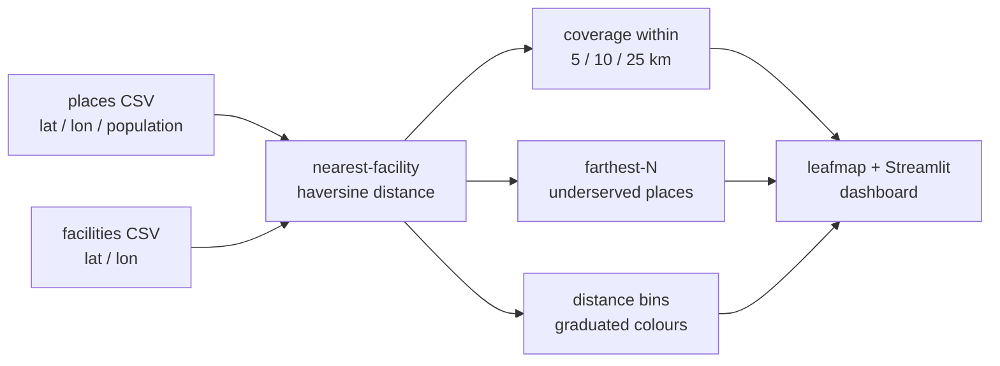

# 🏥 Clinic-access dashboard — Cameroon

[](https://github.com/mbongowo/Data-science-Portfolio/actions/workflows/ci.yml)
[](https://www.python.org/)
[](https://github.com/astral-sh/ruff)
[](LICENSE)
[](https://streamlit.io)

[](https://share.streamlit.io/deploy?repository=mbongowo/Data-science-Portfolio&branch=main&mainModule=spatial/04-leafmap-dashboard/app/streamlit_app.py)

An interactive **leafmap + Streamlit** dashboard that answers one local question:
**which populated places in Cameroon are farthest from a health facility?** Pick
an "underserved" distance threshold, see the places that fall beyond it on the
map, and read off the most underserved settlements.

## Result first

The bundled demo synthesizes ~200 populated places and ~20 facilities inside a
Cameroon bounding box (seeded, reproducible), then runs the real pipeline:

```text
clinic-access demo (seeded synthetic Cameroon points, straight-line distance)
  places=200  facilities=20
  mean nearest   = 40.6 km
  median nearest = 22.9 km
  share within 5 km  = 3.3%
  share within 10 km = 13.4%
  share beyond 25 km = 41.1%
  farthest place = 228.6 km
```

Reproduce it exactly:

```bash
python -m clinicaccess.cli demo
# writes outputs/places_access.csv and outputs/summary.json
```

So on this seeded surface, **41% of the population sits beyond 25 km** of the
nearest facility, and the single most underserved place is **229 km** away — the
kind of long tail the dashboard is built to surface.

## The question it answers

Health planners need a quick, honest first pass at coverage gaps: given where
people live and where clinics are, *which settlements are worst served, and how
many people live too far from care?* This dashboard answers that
interactively — move the threshold slider, watch the map and the metrics update,
and export the ranked list of underserved places.

## Inspired by `opengeos/leafmap`

This project is built on and credits **[`opengeos/leafmap`](https://github.com/opengeos/leafmap)**,
Qiusheng Wu's low-code library for interactive geospatial maps in Python. leafmap
does the heavy lifting of rendering the markers, basemap, and legend; this repo
makes it *my own* by wiring it to a specific local question, a reusable numeric
core, and a one-click Streamlit deploy.

## Method

The core is deliberately simple and fast:

1. **Nearest facility** — for every place, the great-circle (**haversine**)
   distance to the closest facility, computed as a vectorised brute-force
   distance matrix (`clinicaccess.distance`, `clinicaccess.access`).
2. **Coverage** — population within each of the 5 / 10 / 25 km thresholds and the
   share left beyond the largest (NaN-safe, mirroring the equity semantics of the
   sibling `access-to-care`).
3. **Farthest ranking** — the *n* places with the largest nearest-facility
   distance: the underserved tail.
4. **Distance bins** — a graduated band per place (`0-5`, `5-10`, `10-25`,
   `25+ km`) that drives the choropleth-style colours on the map.

### Straight-line, not road travel time

These distances are **straight-line**, not road travel time. That is the point:
haversine is cheap enough to recompute on every slider move, which makes this a
fast **screening** tool to flag candidate gaps. It will understate real access
where rivers, terrain, or missing roads force long detours. For rigorous
**road-network travel time** (multi-source Dijkstra over an OSM graph,
population-weighted by admin unit), see the sibling project
[`access-to-care`](../access-to-care). The two complement each other: screen
here, then route there.

## Pipeline



## Run it locally

```bash
pip install -r requirements.txt        # core + app stack
python -m clinicaccess.cli demo        # reproduce the numbers above
streamlit run app/streamlit_app.py     # launch the dashboard
```

The dashboard loads the bundled sample data by default, so it runs out of the
box.

## Deploy

[](https://share.streamlit.io/deploy?repository=mbongowo/Data-science-Portfolio&branch=main&mainModule=spatial/04-leafmap-dashboard/app/streamlit_app.py)

The badge opens the Streamlit Community Cloud dialog pre-filled with this repo,
the `main` branch, and the main file path
`spatial/04-leafmap-dashboard/app/streamlit_app.py`. Open **Advanced settings**
and set **Python version 3.12** before clicking Deploy. Cloud installs from
`app/requirements.txt` (next to the entrypoint).

> **Live demo:** _add the deployed URL here after the first deploy._

## Use your own area / data

The default is the synthetic Cameroon sample, but the app is data-driven:

- **Upload your own CSVs** from the sidebar — a *places* CSV with `lat`, `lon`,
  `population` (and ideally a `name`), and a *facilities* CSV with `lat`, `lon`
  (and `name`). Lat/lon are in decimal degrees (WGS84).
- **Edit `config/config.yaml`** to change the default bbox, thresholds, the
  farthest-N count, or the colour bins.
- **Run the pipeline headless** on your own files:
  `python -m clinicaccess.cli report places.csv facilities.csv`.

## Results

- Demo (seeded synthetic, 200 places / 20 facilities): median nearest **22.9 km**,
  **41%** of population beyond 25 km, farthest place **229 km** (see the block
  above; full breakdown in `outputs/summary.json`).
- _Real Cameroon finding: to be added once run against a real facility list
  (e.g. Healthsites.io) — placeholder._
- _Deployed app: link to be added after deploy — placeholder._

## Limitations

- **Straight-line distance, not road access.** Haversine ignores roads, rivers,
  and terrain, so it understates real travel burden. Use `access-to-care` for
  road-network travel time.
- **Synthetic / sample data.** The bundled CSVs and the demo are *synthetic but
  plausible* Cameroon coordinates, not a measured dataset. Numbers are
  illustrative.
- **Facility-list completeness.** Results are only as good as the facility
  inputs; missing clinics make places look more underserved than they are, and
  closed ones the reverse.
- **Population allocation.** Each place carries a single population figure at a
  point; sub-place distribution and seasonal movement are not modelled.
