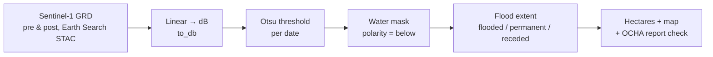

# change-detection: SAR flood mapping & before/after water change (Cameroon)

[](https://github.com/mbongowo/Data-science-Portfolio/actions/workflows/ci.yml)
[](https://www.python.org/)
[](https://github.com/astral-sh/ruff)
[](LICENSE)

Turn a **before/after pair of Sentinel-1 SAR scenes** into *flood numbers*: an
automatic Otsu water threshold per date, a water mask, the before/after
flood-extent change (newly flooded / permanent water / receded), and the hectares
of each — over the recurrently flooded **Logone-et-Chari floodplain** in
Cameroon's Far North.

**Inspired by**
[`robmarkcole/satellite-image-deep-learning`](https://github.com/robmarkcole/satellite-image-deep-learning)
— the field's best catalogue of EO project ideas, where flood mapping is one of
the scoped problems. The design choice here: flood mapping done right uses
**Sentinel-1 SAR**, which sees through cloud (optical sensors are blinded exactly
when it floods), with classic **Otsu** automatic thresholding on backscatter. The
runnable, CI-tested, reproducible contribution is a **pure-numpy flood-mapping
core** (Otsu threshold → water masking → before/after flood extent → hectares),
and the real Sentinel-1 pull is a documented **STAC notebook**. The default data
path is the open **Earth Search** STAC catalogue (Sentinel-1 GRD / Sentinel-2
L2A), **auth-free** — no account, no sign-in, no API key.

This sits alongside the sibling optical-NDVI change projects and does something
different: `02-earth-engine-timeseries` does multi-year **optical NDVI** change;
**this** does **SAR-backscatter water detection + Otsu + flood-extent change**.

---

## Result first

The headline numbers below come from the **runnable demo** (`python -m
floodmap.cli demo`), not a hand-picked example. The demo deterministically
synthesises a small before/after pair of Sentinel-1-like backscatter scenes — dry
land at high backscatter, a permanent **river** that is dark in *both* dates, and
a rectangular **planted flood** block that is dry in `pre` and becomes water in
`post`, plus multiplicative SAR speckle. It then drives the **real pure-numpy
core**: convert to dB, Otsu-threshold each date, build the water masks, compute
the before/after flood extent, and total the hectares.

```
synthetic-demo numbers, reproducible via `python -m floodmap.cli demo`
seed = 0, raster = 100x100, pixel size = 10 m/px (1 km square)

pre  Otsu water threshold        : -13.48 dB
post Otsu water threshold        : -13.36 dB
planted flood (ground truth)     : 12.00 ha   (40 x 30 px block)
detected new-flood extent        : 12.10 ha
permanent water (river)          :  4.01 ha
planted flood recovered          : 0.999      (fraction of the block flagged as flooded)
```

These are the **real** outputs of the pure-numpy core on a **small seeded
synthetic pair** — honest about being synthetic, but reproducible to the digit.
Otsu separates the dark water from the bright land cleanly, the before/after
split removes the permanent river, and the mapper recovers essentially the whole
12 ha planted flood (the small surplus over 12.0 ha is a handful of speckle
pixels). The live Cameroon run (notebook below) uses the *same* core on real
Sentinel-1 composites; only the data source changes.

**Reproduce:**

```bash
python -m floodmap.cli demo     # writes outputs/flood_stats.json + outputs/flood_mask.npy
```

---

## The problem

Cameroon's Far North floods almost every rainy season: the Logone river overspills
and seasonal rains inundate the Logone-et-Chari and Mayo-Danay floodplains,
displacing tens of thousands of people and drowning cropland. The **2024** event
alone affected ~156,000 people in Logone-et-Chari and flooded tens of thousands of
hectares of farmland (UN OCHA). Mapping the flood from space is hard with optical
sensors because floods come with clouds — exactly when you need a clear view. SAR
solves that: radar penetrates cloud and, because smooth water reflects radar away
from the sensor, flooded ground shows up as **dark** backscatter. This project is
the end-to-end pipeline from open Sentinel-1 to a flooded-hectares number you can
put in a table and check against an official report.

## Method

1. **Sentinel-1 GRD from STAC** — search Earth Search for a pre-flood and a
   post-flood scene over the AOI, on one orbit, VH polarization (auth-free).
2. **To decibels** — `to_db` converts linear backscatter to dB, where the
   water/land histogram is cleanly bimodal.
3. **Otsu threshold** — `otsu_threshold` finds the between-class-variance
   maximising water cut-off in the valley between the water and land peaks,
   automatically, per date.
4. **Water mask** — `water_mask(..., polarity="below")`: SAR water is dark, so
   water is below the threshold.
5. **Flood extent** — `flood_extent` splits the two masks into **flooded**
   (post & ~pre), **permanent_water** (pre & post), **receded** (pre & ~post);
   `flood_stats` converts to hectares.
6. **Validate** — compare the flooded-area estimate to a UN OCHA / ReliefWeb
   situation report for the same event.



Step 1 needs the geospatial stack. **Steps 2-5 — the contribution — are pure
numpy**, fully unit-tested, and are exactly what the demo and the notebook's
quantification cells call. An optional **optical MNDWI fallback** (`mndwi` +
`water_mask(..., polarity="above")`) handles the rare cloud-free flood day.

### The core (pure numpy, no third-party deps)

- `floodmap.threshold` — `otsu_threshold` (between-class-variance Otsu on a
  histogram, NaN-aware), `histogram_modes` (the two peak locations).
- `floodmap.water` — `water_mask` (below/above polarity, NaN → not water),
  `to_db` (linear → dB, ≤0 → NaN), `mndwi` (optical water index, 0/0 → NaN).
- `floodmap.change` — `flood_extent` (flooded / permanent / receded masks),
  `flood_stats` (pixels, hectares, scene fraction).

Every function has a **hand-derived known-answer test** (Otsu in the valley of a
two-Gaussian mixture and on a known small array; water-mask polarity; MNDWI of
known bands and 0/0 → NaN; `to_db(0.1) = -10` dB and ≤0 → NaN; flood-extent masks
on hand-laid pre/post arrays; hectares from a known mask). The STAC path
(`floodmap.stac`) imports its heavy dependencies lazily, inside functions, so
neither the core nor the test suite needs the geospatial stack.

---

## Run it

### The core, demo, and tests (local, numpy only)

```bash
python -m venv .venv && . .venv/bin/activate   # Windows: .venv\Scripts\activate
pip install -r requirements.txt                # core needs only numpy/pandas/pyyaml
pip install -e .

python -m floodmap.cli demo                    # reproduces the numbers above

# tests (numpy + stdlib only):
#   PowerShell:  $env:PYTHONPATH="src"; python -m pytest tests -q
#   bash:        PYTHONPATH=src python -m pytest tests -q
```

### The live Cameroon run from STAC (auth-free)

`notebooks/01_sar_flood_mapping.ipynb` is the default workflow: pull Sentinel-1
GRD pre/post backscatter for the Logone AOI from Earth Search, convert to dB,
Otsu-threshold each, derive water masks, compute the flood extent and hectares,
map the flood, and compare to the UN OCHA report. **No account needed.** Install
the geospatial stack with the conda env (recommended for GDAL/GEOS/PROJ):

```bash
conda env create -f environment.yml
conda activate flood-change-detection
```

CLI equivalent for the heavy step:

```bash
floodmap map --config config/aoi.yaml          # before/after flood extent in hectares
```

---

## Use your own area / event

The repo ships with a **Logone-et-Chari (Far North Cameroon) default so it runs
out of the box**, but it is built to point anywhere. To map a different
flood, edit only the relevant blocks in [`config/aoi.yaml`](config/aoi.yaml):

- set `aoi.bbox` (`min_lon / min_lat / max_lon / max_lat`, EPSG:4326) to your area
  — keep it a few tens of km across so the STAC load stays tractable;
- set `aoi.crs` to your local UTM zone for area-correct measurement (the Far North
  is EPSG:32633; look others up at [epsg.io](https://epsg.io));
- set `pre_date` (a genuinely **dry** scene) and `post_date` (the **peak-flood**
  scene) — a single ISO date or a short `start/end` range to catch a pass;
- keep `analysis.orbit` and `analysis.polarization` (VH) the **same** for both
  dates so the backscatter is comparable.

Nothing else changes: the `map` CLI and the notebook's quantification core all
read the AOI from this one file.

---

## Results

### Synthetic demo (reproducible, numpy only)

| metric                          | value      |
| ------------------------------- | ---------- |
| raster / pixel size             | 100×100 / 10 m |
| pre Otsu water threshold        | -13.48 dB  |
| post Otsu water threshold       | -13.36 dB  |
| planted flood (ground truth)    | 12.00 ha   |
| detected new-flood extent       | 12.10 ha   |
| permanent water (river)         | 4.01 ha    |
| planted flood recovered         | 0.999      |

### Live Cameroon run (fill in after running the notebook)

Run `notebooks/01_sar_flood_mapping.ipynb` on the AOI and record the numbers here,
including the validation row against the UN OCHA situation report for the same
event. Placeholder pending a live run:

| metric                                  | value (TODO)                |
| --------------------------------------- | --------------------------- |
| event                                   | 2024 Far North floods       |
| pre-flood date                          | 2024-05 (dry season)        |
| post-flood date                         | 2024-09 (peak flood)        |
| SAR new-flood extent (this repo)        | _TODO_ ha                   |
| permanent water (river/lake)            | _TODO_ ha                   |
| **OCHA farmland flooded (validation)**  | 82,509 ha (Far North, region-wide) |
| **OCHA people affected (Logone-et-Chari)** | 156,000 (3 Oct 2024)     |
| AOI bbox                                | 14.85–15.10 E, 11.95–12.20 N |

The OCHA row is the external credibility check. It is an order-of-magnitude check,
not like-for-like: the OCHA figure is region-wide *farmland*, while our bbox
covers part of the floodplain and SAR maps *all* standing water — clip to a common
footprint before comparing (see the notebook). Source: UN OCHA via
[ReliefWeb — Cameroon: Floods, Aug 2024](https://reliefweb.int/disaster/fl-2024-000162-cmr).

---

## Limitations

- **SAR layover & shadow over terrain.** Layover and radar shadow create dark
  patches that mimic water; the flat Logone floodplain is favourable, but hilly
  AOIs need a DEM mask.
- **Permanent vs flood-water confusion.** The before/after design removes the
  channel, but a "pre" scene that already has high water undercounts the flood;
  choose a genuinely dry pre date.
- **Single-orbit / incidence-angle effects.** Backscatter depends on orbit and
  incidence angle; keep both fixed across pre and post (done here) so the
  comparison is fair.
- **Speckle.** SAR's multiplicative speckle scatters isolated misclassified
  pixels; a smoothing / morphological clean-up before thresholding reduces it.
- **Optical clouds during floods.** The Sentinel-2 MNDWI fallback only works on
  cloud-free days — usually unavailable during a flood, which is the whole reason
  SAR is the default.
- **Validation needed.** OCHA counts damaged farmland, not standing-water extent;
  treat the comparison as a sanity check and confirm against a higher-resolution
  or field reference before reporting a number.

---

## License

MIT © 2026 Joseph Mbuh
